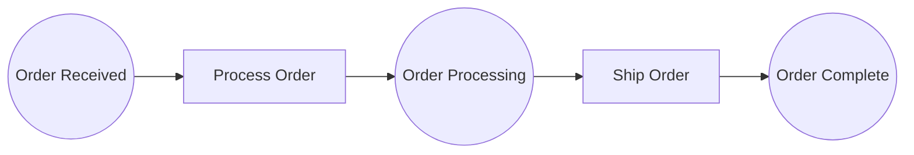

# Example 01: Simple Order Processing

A linear three-place pipeline that processes and ships an order. The simplest possible JazzPetri workflow — three places, two transitions, one token flowing start to finish.

## Petri Net Diagram



## Run

```bash
go run ./examples/01_simple_workflow
```

## What It Demonstrates

- **Places** hold tokens (data). `order_received` is the initial place; `order_complete` is terminal.
- **Transitions** perform work via `InlineTask` closures attached with `WithTask()`.
- **Arcs** connect places to transitions (input) and transitions to places (output).
- **Engine** polls for enabled transitions and fires them sequentially.
- **Resolve()** converts string ID references to direct pointers for efficient graph traversal.
