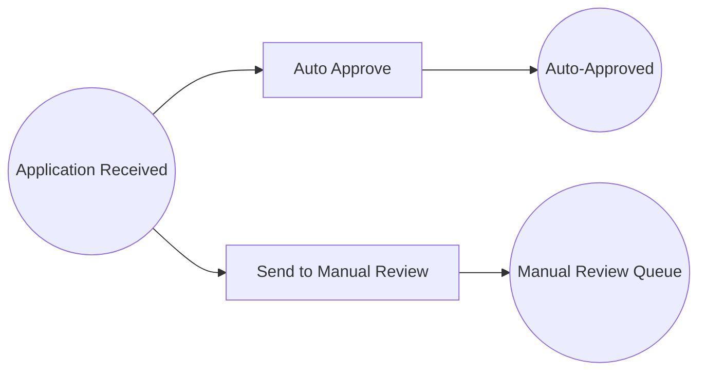

# Example 02: Conditional Routing with Guards

An OR-split workflow where guard functions route a loan application based on credit score. Two transitions share the same input place — only the one whose guard passes will fire.

## Petri Net Diagram



## Run

```bash
go run ./examples/02_conditional_routing
```

## What It Demonstrates

- **Guard functions** receive the execution context and candidate tokens, returning `(bool, error)`.
- **OR-split** pattern: multiple transitions compete for the same input place; only the enabled one fires.
- **Data-driven routing**: the credit score inside the `MapToken` determines the path.
- Running the same net twice with different data produces different execution paths.
