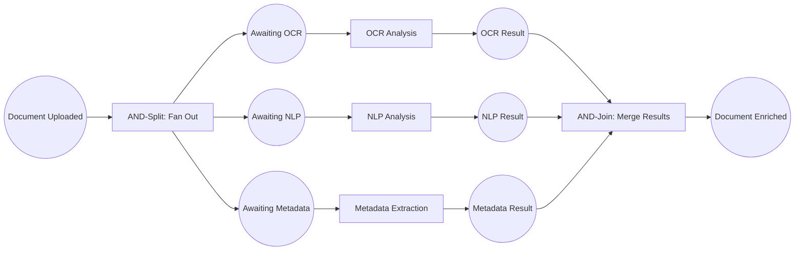

# Example 03: Parallel Document Processing (AND-split/join)

A document enrichment pipeline that fans out to three concurrent analysis branches (OCR, NLP, metadata extraction) and joins the results before storing the enriched document.

## Petri Net Diagram



## Run

```bash
go run ./examples/03_parallel_processing
```

## What It Demonstrates

- **AND-split**: one transition produces tokens in multiple output places simultaneously.
- **AND-join**: a transition requires tokens from all input places before it can fire.
- **ModeConcurrent**: the engine fires independent transitions in parallel goroutines.
- **MaxConcurrentTransitions**: limits the goroutine pool size.
- Total wall time is bounded by the slowest branch, not the sum of all branches.
