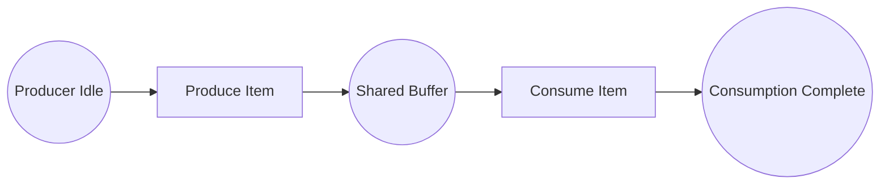

# Example 04: Formal Verification

Proves safety properties about a producer-consumer workflow **before it runs**. JazzPetri builds the complete state space via breadth-first search and checks seven properties with mathematical certainty.

## Petri Net Diagram



## Run

```bash
go run ./examples/04_formal_verification
```

## What It Demonstrates

- **State space exploration**: exhaustive BFS enumerates every reachable marking.
- **Boundedness**: no place accumulates unlimited tokens.
- **Deadlock freedom**: no reachable non-terminal state blocks forever.
- **Reachability**: the `done` place is reachable from the initial marking.
- **Mutual exclusion**: `idle` and `done` are never both occupied simultaneously.
- **Place invariants**: total tokens across `idle + buffer + done` never exceeds 1.
- **Proof certificate**: a structured summary of all verification results.
