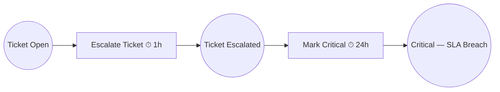

# Example 05: Timed Triggers with VirtualClock

An SLA escalation workflow where transitions fire after time delays. Uses `VirtualClock` so the entire 25-hour workflow completes instantly — the clock is advanced programmatically, not waited on.

## Petri Net Diagram



## Run

```bash
go run ./examples/05_timed_triggers
```

## What It Demonstrates

- **TimedTrigger**: delays transition firing by a configurable duration after it becomes enabled.
- **VirtualClock**: programmatic time control — `AdvanceBy(1*time.Hour)` instantly fires the timer.
- **RealTimeClock vs VirtualClock**: swap with a single import for production vs testing.
- Deterministic testing of time-dependent workflows without real-time waits.
