# Example 06: Human Approval with ManualTrigger

An expense report approval workflow where the transition blocks until a human approver explicitly signals approval. Models real-world patterns like expense sign-offs, code review gates, and deployment authorization.

## Petri Net Diagram

```mermaid
graph LR
  submitted((Expense Submitted))
  approved((Expense Approved))
  approve[Approve Expense Report 👤]
  submitted --> approve
  approve --> approved
```



## Run

```bash
go run ./examples/06_human_approval
```

## What It Demonstrates

- **ManualTrigger**: blocks the transition until `trigger.Approve(userID)` is called.
- **Approver list**: only authorized users (listed in `Approvers`) can approve.
- **RequireAll**: when `false`, any single approver is sufficient; when `true`, all must approve.
- **Timeout**: optional SLA enforcement — if no approval arrives in time, the transition does not fire.
- **Audit trail**: `IsApproved()` and `ApprovedBy()` provide a full approval record.
- In production, the approval would come from a REST API, web UI, or Slack command.
